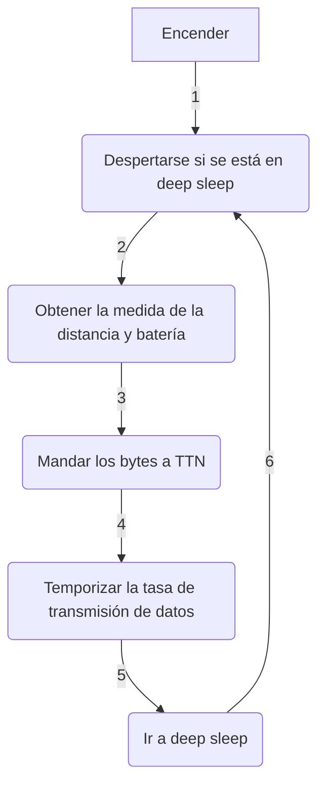

<div align="right">

[](./README.md) | [](./README_ES.md)

</div>

<div align="center">

# MINI ESTACIÓN DE CALIDAD DEL AIRE CONECTADA POR LORA A BORDO DE UN DRONE

[](https://code.visualstudio.com/) [![Build with PlatformIO](https://img.shields.io/badge/build%20with-PlatformIO-orange?logo=data%3Aimage%2Fsvg%2Bxml%3Bbase64%2CPHN2ZyB3aWR0aD0iMjUwMCIgaGVpZ2h0PSIyNTAwIiB2aWV3Qm94PSIwIDAgMjU2IDI1NiIgeG1sbnM9Imh0dHA6Ly93d3cudzMub3JnLzIwMDAvc3ZnIiBwcmVzZXJ2ZUFzcGVjdFJhdGlvPSJ4TWlkWU1pZCI+PHBhdGggZD0iTTEyOCAwQzkzLjgxIDAgNjEuNjY2IDEzLjMxNCAzNy40OSAzNy40OSAxMy4zMTQgNjEuNjY2IDAgOTMuODEgMCAxMjhjMCAzNC4xOSAxMy4zMTQgNjYuMzM0IDM3LjQ5IDkwLjUxQzYxLjY2NiAyNDIuNjg2IDkzLjgxIDI1NiAxMjggMjU2YzM0LjE5IDAgNjYuMzM0LTEzLjMxNCA5MC41MS0zNy40OUMyNDIuNjg2IDE5NC4zMzQgMjU2IDE2Mi4xOSAyNTYgMTI4YzAtMzQuMTktMTMuMzE0LTY2LjMzNC0zNy40OS05MC41MUMxOTQuMzM0IDEzLjMxNCAxNjIuMTkgMCAxMjggMCIgZmlsbD0iI0ZGN0YwMCIvPjxwYXRoIGQ9Ik0yNDkuMzg2IDEyOGMwIDY3LjA0LTU0LjM0NyAxMjEuMzg2LTEyMS4zODYgMTIxLjM4NkM2MC45NiAyNDkuMzg2IDYuNjEzIDE5NS4wNCA2LjYxMyAxMjggNi42MTMgNjAuOTYgNjAuOTYgNi42MTQgMTI4IDYuNjE0YzY3LjA0IDAgMTIxLjM4NiA1NC4zNDYgMTIxLjM4NiAxMjEuMzg2IiBmaWxsPSIjRkZGIi8+PHBhdGggZD0iTTE2MC44NjkgNzQuMDYybDUuMTQ1LTE4LjUzN2M1LjI2NC0uNDcgOS4zOTItNC44ODYgOS4zOTItMTAuMjczIDAtNS43LTQuNjItMTAuMzItMTAuMzItMTAuMzJzLTEwLjMyIDQuNjItMTAuMzIgMTAuMzJjMCAzLjc1NSAyLjAxMyA3LjAzIDUuMDEgOC44MzdsLTUuMDUgMTguMTk1Yy0xNC40MzctMy42Ny0yNi42MjUtMy4zOS0yNi42MjUtMy4zOWwtMi4yNTggMS4wMXYxNDAuODcybDIuMjU4Ljc1M2MxMy42MTQgMCA3My4xNzctNDEuMTMzIDczLjMyMy04NS4yNyAwLTMxLjYyNC0yMS4wMjMtNDUuODI1LTQwLjU1NS01Mi4xOTd6TTE0Ni41MyAxNjQuOGMtMTEuNjE3LTE4LjU1Ny02LjcwNi02MS43NTEgMjMuNjQzLTY3LjkyNSA4LjMyLTEuMzMzIDE4LjUwOSA0LjEzNCAyMS41MSAxNi4yNzkgNy41ODIgMjUuNzY2LTM3LjAxNSA2MS44NDUtNDUuMTUzIDUxLjY0NnptMTguMjE2LTM5Ljc1MmE5LjM5OSA5LjM5OSAwIDAgMC05LjM5OSA5LjM5OSA5LjM5OSA5LjM5OSAwIDAgMCA5LjQgOS4zOTkgOS4zOTkgOS4zOTkgMCAwIDAgOS4zOTgtOS40IDkuMzk5IDkuMzk5IDAgMCAwLTkuMzk5LTkuMzk4em0yLjgxIDguNjcyYTIuMzc0IDIuMzc0IDAgMSAxIDAtNC43NDkgMi4zNzQgMi4zNzQgMCAwIDEgMCA0Ljc0OXoiIGZpbGw9IiNFNTcyMDAiLz48cGF0aCBkPSJNMTAxLjM3MSA3Mi43MDlsLTUuMDIzLTE4LjkwMWMyLjg3NC0xLjgzMiA0Ljc4Ni01LjA0IDQuNzg2LTguNzAxIDAtNS43LTQuNjItMTAuMzItMTAuMzItMTAuMzItNS42OTkgMC0xMC4zMTkgNC42Mi0xMC4zMTkgMTAuMzIgMCA1LjY4MiA0LjU5MiAxMC4yODkgMTAuMjY3IDEwLjMxN0w5NS44IDc0LjM3OGMtMTkuNjA5IDYuNTEtNDAuODg1IDIwLjc0Mi00MC44ODUgNTEuODguNDM2IDQ1LjAxIDU5LjU3MiA4NS4yNjcgNzMuMTg2IDg1LjI2N1Y2OC44OTJzLTEyLjI1Mi0uMDYyLTI2LjcyOSAzLjgxN3ptMTAuMzk1IDkyLjA5Yy04LjEzOCAxMC4yLTUyLjczNS0yNS44OC00NS4xNTQtNTEuNjQ1IDMuMDAyLTEyLjE0NSAxMy4xOS0xNy42MTIgMjEuNTExLTE2LjI4IDMwLjM1IDYuMTc1IDM1LjI2IDQ5LjM2OSAyMy42NDMgNjcuOTI2em0tMTguODItMzkuNDZhOS4zOTkgOS4zOTkgMCAwIDAtOS4zOTkgOS4zOTggOS4zOTkgOS4zOTkgMCAwIDAgOS40IDkuNCA5LjM5OSA5LjM5OSAwIDAgMCA5LjM5OC05LjQgOS4zOTkgOS4zOTkgMCAwIDAtOS4zOTktOS4zOTl6bS0yLjgxIDguNjcxYTIuMzc0IDIuMzc0IDAgMSAxIDAtNC43NDggMi4zNzQgMi4zNzQgMCAwIDEgMCA0Ljc0OHoiIGZpbGw9IiNGRjdGMDAiLz48L3N2Zz4=)](https://platformio.org/)

## Proyecto basado en: [alexcorvis84/mini-lora-weatherstation](https://github.com/alexcorvis84/mini-lora-weatherstation)

</div>

___

<div align="justify">

## Índice
- [Introducción](https://github.com/medialablpwan/lorawaterlevelmonitoring/blob/main/README_ES.md#introducci%C3%B3n-leftwards_arrow_with_hook)
- [Funciones principales](https://github.com/medialablpwan/lorawaterlevelmonitoring/blob/main/README_ES.md#-caracter%C3%ADsticas-principales-leftwards_arrow_with_hook-)
- [Lista de componentes](https://github.com/medialablpwan/lorawaterlevelmonitoring/blob/main/README_ES.md#-lista-de-componentes-leftwards_arrow_with_hook-)
- [Lista de conexiones](https://github.com/medialablpwan/lorawaterlevelmonitoring/blob/main/README_ES.md#-lista-de-conexiones-leftwards_arrow_with_hook-)
- [Flujograma (¡Simplificado!)](https://github.com/medialablpwan/lorawaterlevelmonitoring/blob/main/README_ES.md#-flujograma-simplificado-leftwards_arrow_with_hook-)
- [Archivos de código](https://github.com/medialablpwan/lorawaterlevelmonitoring/blob/main/README_ES.md#archivos-de-c%C3%B3digo-leftwards_arrow_with_hook)
- [Librerías](https://github.com/medialablpwan/lorawaterlevelmonitoring/blob/main/README_ES.md#librer%C3%ADas-leftwards_arrow_with_hook)
- [Experimento de despliegue](https://github.com/medialablpwan/lorawaterlevelmonitoring/blob/main/README_ES.md#-experimento-de-despliegue-leftwards_arrow_with_hook-)
- [Licencia](https://github.com/medialablpwan/lorawaterlevelmonitoring/blob/main/README_ES.md#-licencia-leftwards_arrow_with_hook-)
- [Contacto](https://github.com/medialablpwan/lorawaterlevelmonitoring/blob/main/README_ES.md#-contacto-leftwards_arrow_with_hook-)

</div>

___

<div align="justify">

## Introducción [:leftwards_arrow_with_hook:](https://github.com/medialablpwan/lorawaterlevelmonitoring/blob/main/README_ES.md#%C3%ADndice)

Como parte de mi Trabajo de Fin de Grado sobre drones y sensorización, en Medialab_ LPWAN, se me dio a conocer la tecnología de LoRaWAN. Con ella, entendí rápidamente el potencial de trabajar en un sensor de calidad de aire que montar en un drone de _long range_ para ser usado como plataforma móvil y medir a kilómetros de distancia atmósferas hostiles en caso de accidente donde fuese peligroso enviar a un equipo de personas. Como resultado, nació el sensor _on-board_ que os voy a mostrar como un nodo conectado por LoRa, sincronizable con [The Things Network](https://www.thethingsnetwork.org/), que montarle al drone que construí sin que la cobertura fuese un factor limitante.

</div>

<div align="center">
  
</div>
<br/>

<p align="justify"> En este repositorio, encontrarás todos los archivos y guías educativas necesarias para entender con totalidad e incluso tomarte la libertad creativa de mejorar este proyecto. Las carpetas y archivos han sido llamados con nombres que se explican a ellos mismos para hacer la navegación más intuitiva. </p>

___

### <p align="justify"> Características principales [:leftwards_arrow_with_hook:](https://github.com/medialablpwan/lorawaterlevelmonitoring/blob/main/README_ES.md#%C3%ADndice) </p>

- <p align="justify"> Desarrollado usando la HelTec CubeCell HTCC AB01 (Una placa de muy bajo consumo con LoRa implementado y que soporta recarga con panel solar y gestión de batería) </p>

  <div align="center">
    
  </div>
  <br/>

- <p align="justify"> Cambios realizados para añadirle, además, un sensor CCS811 (Sensor de partículas volátiles) </p>

  <div align="center">
    
  </div>
  <br/>

> [!WARNING]
> Este sensor es extremádamente sensible a perturbaciones físicas. Estate seguro de alinearlo perfectamente de forma perpendicular con la superficie donde rebote el haz y de tener visión directa a ella

<div align="justify">

- Tasa dinámica de transmisión de datos: el intervalo de envío cambia automáticamente su valor entre 20 y 40 minutos en función de la desviación típica de las últimas 5 medidas enviadas a TTN. (Por OTAA, [`payload_formatter.json`](https://github.com/medialablpwan/lorawaterlevelmonitoring/blob/main/payload_formatter.json) es una sugerencia de cómo decodificar los bytes enviados)

  <div align="center">
    
  </div>
  <br/>

</div>

- <p align="justify"> PCB a medida </p>

  <div align="center">
    
  </div>
  <br/>

> [!TIP]
> Considera soldar conectores hembra para pines para que los componentes se puedan conectar y desconectar de forma simple en caso de tener que hacer una reparación

- <p align="justify"> Carcasa a medida para encajar todos los componentes de la forma más eficiente (Recipiente + Soporte del panel solar + Protector del conector USB) </p>

  <div align="center">
    
  </div>
  <br/>
  <div align="center">
    
  </div>
  <br/>
  <div align="center">
    
  </div>
  <br/>

  > Ejemplo de ensamblaje:
  <div align="center">
    
  </div>
  <br/>

> [!WARNING]
> Es muy recomendable emplear filamento de impresión 3D de PETG de color claro para sobrevivir a la radiación solar y a las deformaciones plásticas. Una tórica es una buena opción para fijar y estabilizar el sensor dentro de la campana. Hacen falta cuatro tornillos M3 para fijar el ensamblado

___

### <p align="justify"> Lista de componentes [:leftwards_arrow_with_hook:](https://github.com/medialablpwan/lorawaterlevelmonitoring/blob/main/README_ES.md#%C3%ADndice) </p>

<div align="center">

| Componente | Modelo |
| ------------- | ------------- |
| Placa  | [LilyGO LoRa32 OLED v2.1_1.6](https://www.tinytronics.nl/shop/en/development-boards/microcontroller-boards/with-lora/lilygo-ttgo-t3-lora32-868mhz-v1.6.1-esp32) |
| Sensor de distancia  | [JSN-SR04T](https://www.tinytronics.nl/shop/en/sensors/distance/waterproof-ultrasonic-sensor-jsn-sr04t) |
| Batería  | [18650](https://www.tinytronics.nl/shop/en/power/batteries/18650/eve-18650-li-ion-battery-3100mah-10a-inr18650-33v) |
| Panel solar  | [SYP-S0606](https://www.tinytronics.nl/shop/en/power/solar-energy/solar-panels/solar-panel-with-dc-dc-converter-and-usb-5v-1a) |
| PCB  | [A medida (archivo incluido)](https://github.com/medialablpwan/lorawaterlevelmonitoring/tree/main/pcb) |
| Carcasa  | [A medida (archivo inlcuido)](https://github.com/medialablpwan/lorawaterlevelmonitoring/tree/main/carc) |

</div>

___

### <p align="justify"> Lista de conexiones [:leftwards_arrow_with_hook:](https://github.com/medialablpwan/lorawaterlevelmonitoring/blob/main/README_ES.md#%C3%ADndice) </p>

<div align="center">

| JSN-SR04T | 18650 | SYP-S0606 | LilyGO |
| ------------- | ------------- | ------------- | ------------- |
| `trigger` | - | - | `13` |
| `echo` | - | - | `12` |
| `5v` | - | - | `00` |
| `GND` | - | - | `GND` |
| - | `Con Bat` | - | `Con Bat` |
| - | - | `USB` | `USB` |

</div>

> En una protoboard se ve de la siguienta forma:

<div align="center">
  
</div>
<br/>

> [!TIP]
> La PCB ofrece la posibilidad de conectar un botón entre GPIO23 y GND para ser programado como se desee

___

### <p align="justify"> Flujograma (¡Simplificado!) [:leftwards_arrow_with_hook:](https://github.com/medialablpwan/lorawaterlevelmonitoring/blob/main/README_ES.md#%C3%ADndice) </p>



___

<div align="justify">

### Archivos de código [:leftwards_arrow_with_hook:](https://github.com/medialablpwan/lorawaterlevelmonitoring/blob/main/README_ES.md#%C3%ADndice)

En esta sección, se da una descripción breve a cómo está distribuido el código entre los archivos en [`medialablpwan/lorawaterlevelmonitoring/main/`](https://github.com/medialablpwan/lorawaterlevelmonitoring/tree/main/main), donde el código está disponible para flashear o editar:

- [`main.ino`](https://github.com/medialablpwan/lorawaterlevelmonitoring/blob/main/main/main.ino)
  ```C
  /*
  Definición de funciones globales
  Variables a ser almacenadas en la memoria RTC
  Funciones 'setup()' y 'loop()'
  */
  ```
- [`sensor.ino`](https://github.com/medialablpwan/lorawaterlevelmonitoring/blob/main/main/sensor.ino)
  ```C
  /*
  Funciones y variables necesarias para hacer funcionar el sensor
  */
  ```
- [`ddc.ino`](https://github.com/medialablpwan/lorawaterlevelmonitoring/blob/main/main/ddc.ino)
  ```C
  /*
  Funciones y variables para la implementación de la tasa dinámica de transferencia de datos
  */
- [`sleep.ino`](https://github.com/medialablpwan/lorawaterlevelmonitoring/blob/main/main/sleep.ino)
  ```C
  /*
  Funciones para activar el modo deep sleep de la ESP32
  */
- [`ttn.ino`](https://github.com/medialablpwan/lorawaterlevelmonitoring/blob/main/main/ttn.ino)
  ```C
  /*
  Funciones de la librería LMIC
  */
- [`configuration.h`](https://github.com/medialablpwan/lorawaterlevelmonitoring/blob/main/main/configuration.h)
  ```C
  /*
  Macros de los sensores y opciones ON/OFF
  */
- [`credentials.h`](https://github.com/medialablpwan/lorawaterlevelmonitoring/blob/main/main/credentials.h)
  ```C
  /*
  Claves OTAA para la sincronización en TTN
  */
- [`lmic_project_config.h`](https://github.com/medialablpwan/lorawaterlevelmonitoring/blob/main/main/lmic_project_config.h)
  ```C
  /*
  Banda de frecuencia LoRa y selector del chip de radio
  */
Un análisis más en profundidad viene dado en el propio código ya que cada función está explicada con comentarios.

</div>

> [!TIP]
> Los archivos más importantes a editar son `sensor.ino`, donde se puede implementar cualquier sensor, y `configuration.h`, donde se declaran las macros de los periféricos

> [!CAUTION]
> Se necesita código adicional para implementar I/O por I2C. Las funciones para hacerlo funcionar están en el proyecto original en [`TTGO-PAXCOUNTER-LoRa32-V2.1-TTN/main/main.ino`](https://github.com/rwanrooy/TTGO-PAXCOUNTER-LoRa32-V2.1-TTN/blob/master/main/main.ino)

___

<div align="justify">

### Librerías [:leftwards_arrow_with_hook:](https://github.com/medialablpwan/lorawaterlevelmonitoring/blob/main/README_ES.md#%C3%ADndice)

- Librería de placas de LilyGO (Copiar el link en la tab de `Preferences` y escoger `TTGO LoRa32 OLED` como `Board` en Arduino IDE): https://github.com/Xinyuan-LilyGO/LilyGo-LoRa-Series/blob/master/boards/t3_s3_v1_x.json

- LMIC (Copia los contenidos del archivo del proyecto `main/lmic_project_config.h` al archivo de la librería `arduino-lmic/project_config/lmic_project_config.h` y desmarca la banda de frecuencia correspondiente a tu región. ¡El sketch siempre busca la configuración de región en la carpeta de la librería!): https://github.com/mcci-catena/arduino-lmic

- QuickMedianLib (Para obtener medidas de distancia más sólidas): https://github.com/luisllamasbinaburo/Arduino-QuickMedian

- ESP sleep (Para reducir el consumo de la batería): https://github.com/pycom/pycom-esp-idf/blob/master/components/esp32/include/esp_sleep.h

</div>

> [!NOTE]
> Otras librerías, como la librería SPI, son descargables de forma fácil desde Arduino IDE

___

___

## <p align="justify"> Experimento de despliegue [:leftwards_arrow_with_hook:](https://github.com/medialablpwan/lorawaterlevelmonitoring/blob/main/README_ES.md#%C3%ADndice) </p>

### <p align="justify"> La primera unidad se ha desplegado cerca de la Escuela Politécnica de Ingeniería de Gijón: </p>

<div align="center">
  
</div>
<br/>
<div align="center">
  
</div>
<br/>

___

### Accede al panel de Grafana[^1] por medio de este código QR o el link de debajo:

<div align="center">
  
</div>
<br/>

<p align="center"> http://4f566df1fed52c6e7fd5f661f64ae3eb.balena-devices.com:8080/d/vJhQNCZgz/sensores-jsn-sr04t-arroyo-de-san-miguel?from=now-24h&orgId=1&to=now&refresh=1m </p>

___

___

## <p align="justify"> Licencia [:leftwards_arrow_with_hook:](https://github.com/medialablpwan/lorawaterlevelmonitoring/blob/main/README_ES.md#%C3%ADndice) </p>

Este proyecto está licenciado bajo la [GPL-3.0 license](https://github.com/rwanrooy/TTGO-PAXCOUNTER-LoRa32-V2.1-TTN/blob/master/LICENSE). Contiene código de [rwanrooy/TTGO-PAXCOUNTER-LoRa32-V2.1-TTN](https://github.com/rwanrooy/TTGO-PAXCOUNTER-LoRa32-V2.1-TTN)

___

### <p align="justify"> Contacto [:leftwards_arrow_with_hook:](https://github.com/medialablpwan/lorawaterlevelmonitoring/blob/main/README_ES.md#%C3%ADndice) </p>

> [!IMPORTANT]
> Responderemos amablemente a dudas y leeremos sugerencias: [](mailto:medialablpwan@gmail.com)
> 
> Más información sobre nuestras actividades: [](https://www.linkedin.com/groups/9298597/)

_<p align="justify"> Autores: Daniel Rodríguez Moya, Óscar Gijón, Ramón Rubio y el grupo de trabajo de MediaLab\_ LPWAN :shipit: </p>_

[^1]: Instrucciones sobre como desplegar paneles de Grafana en el siguiente repo [`medialablpwan/documentacion`](https://github.com/medialablpwan/documentacion).
