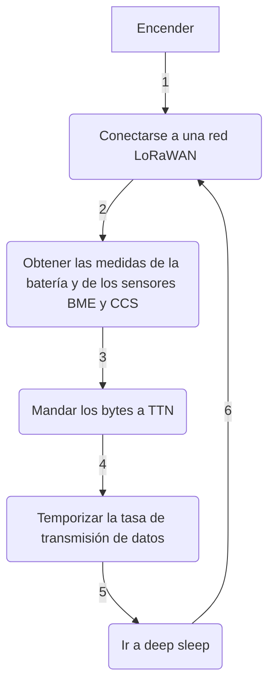

[](https://github.com/mkenney/software-guides/blob/master/STABILITY-BADGES.md#release-candidate)

<div align="right">

[](./README.md) | [](./README_EN.md)

</div>

<div align="center">

# LORA MINI AIR QUALITY DRONE ON-BOARD STATION

[](https://code.visualstudio.com/) [![Build with PlatformIO](https://img.shields.io/badge/build%20with-PlatformIO-orange?logo=data%3Aimage%2Fsvg%2Bxml%3Bbase64%2CPHN2ZyB3aWR0aD0iMjUwMCIgaGVpZ2h0PSIyNTAwIiB2aWV3Qm94PSIwIDAgMjU2IDI1NiIgeG1sbnM9Imh0dHA6Ly93d3cudzMub3JnLzIwMDAvc3ZnIiBwcmVzZXJ2ZUFzcGVjdFJhdGlvPSJ4TWlkWU1pZCI+PHBhdGggZD0iTTEyOCAwQzkzLjgxIDAgNjEuNjY2IDEzLjMxNCAzNy40OSAzNy40OSAxMy4zMTQgNjEuNjY2IDAgOTMuODEgMCAxMjhjMCAzNC4xOSAxMy4zMTQgNjYuMzM0IDM3LjQ5IDkwLjUxQzYxLjY2NiAyNDIuNjg2IDkzLjgxIDI1NiAxMjggMjU2YzM0LjE5IDAgNjYuMzM0LTEzLjMxNCA5MC41MS0zNy40OUMyNDIuNjg2IDE5NC4zMzQgMjU2IDE2Mi4xOSAyNTYgMTI4YzAtMzQuMTktMTMuMzE0LTY2LjMzNC0zNy40OS05MC41MUMxOTQuMzM0IDEzLjMxNCAxNjIuMTkgMCAxMjggMCIgZmlsbD0iI0ZGN0YwMCIvPjxwYXRoIGQ9Ik0yNDkuMzg2IDEyOGMwIDY3LjA0LTU0LjM0NyAxMjEuMzg2LTEyMS4zODYgMTIxLjM4NkM2MC45NiAyNDkuMzg2IDYuNjEzIDE5NS4wNCA2LjYxMyAxMjggNi42MTMgNjAuOTYgNjAuOTYgNi42MTQgMTI4IDYuNjE0YzY3LjA0IDAgMTIxLjM4NiA1NC4zNDYgMTIxLjM4NiAxMjEuMzg2IiBmaWxsPSIjRkZGIi8+PHBhdGggZD0iTTE2MC44NjkgNzQuMDYybDUuMTQ1LTE4LjUzN2M1LjI2NC0uNDcgOS4zOTItNC44ODYgOS4zOTItMTAuMjczIDAtNS43LTQuNjItMTAuMzItMTAuMzItMTAuMzJzLTEwLjMyIDQuNjItMTAuMzIgMTAuMzJjMCAzLjc1NSAyLjAxMyA3LjAzIDUuMDEgOC44MzdsLTUuMDUgMTguMTk1Yy0xNC40MzctMy42Ny0yNi42MjUtMy4zOS0yNi42MjUtMy4zOWwtMi4yNTggMS4wMXYxNDAuODcybDIuMjU4Ljc1M2MxMy42MTQgMCA3My4xNzctNDEuMTMzIDczLjMyMy04NS4yNyAwLTMxLjYyNC0yMS4wMjMtNDUuODI1LTQwLjU1NS01Mi4xOTd6TTE0Ni41MyAxNjQuOGMtMTEuNjE3LTE4LjU1Ny02LjcwNi02MS43NTEgMjMuNjQzLTY3LjkyNSA4LjMyLTEuMzMzIDE4LjUwOSA0LjEzNCAyMS41MSAxNi4yNzkgNy41ODIgMjUuNzY2LTM3LjAxNSA2MS44NDUtNDUuMTUzIDUxLjY0NnptMTguMjE2LTM5Ljc1MmE5LjM5OSA5LjM5OSAwIDAgMC05LjM5OSA5LjM5OSA5LjM5OSA5LjM5OSAwIDAgMCA5LjQgOS4zOTkgOS4zOTkgOS4zOTkgMCAwIDAgOS4zOTgtOS40IDkuMzk5IDkuMzk5IDAgMCAwLTkuMzk5LTkuMzk4em0yLjgxIDguNjcyYTIuMzc0IDIuMzc0IDAgMSAxIDAtNC43NDkgMi4zNzQgMi4zNzQgMCAwIDEgMCA0Ljc0OXoiIGZpbGw9IiNFNTcyMDAiLz48cGF0aCBkPSJNMTAxLjM3MSA3Mi43MDlsLTUuMDIzLTE4LjkwMWMyLjg3NC0xLjgzMiA0Ljc4Ni01LjA0IDQuNzg2LTguNzAxIDAtNS43LTQuNjItMTAuMzItMTAuMzItMTAuMzItNS42OTkgMC0xMC4zMTkgNC42Mi0xMC4zMTkgMTAuMzIgMCA1LjY4MiA0LjU5MiAxMC4yODkgMTAuMjY3IDEwLjMxN0w5NS44IDc0LjM3OGMtMTkuNjA5IDYuNTEtNDAuODg1IDIwLjc0Mi00MC44ODUgNTEuODguNDM2IDQ1LjAxIDU5LjU3MiA4NS4yNjcgNzMuMTg2IDg1LjI2N1Y2OC44OTJzLTEyLjI1Mi0uMDYyLTI2LjcyOSAzLjgxN3ptMTAuMzk1IDkyLjA5Yy04LjEzOCAxMC4yLTUyLjczNS0yNS44OC00NS4xNTQtNTEuNjQ1IDMuMDAyLTEyLjE0NSAxMy4xOS0xNy42MTIgMjEuNTExLTE2LjI4IDMwLjM1IDYuMTc1IDM1LjI2IDQ5LjM2OSAyMy42NDMgNjcuOTI2em0tMTguODItMzkuNDZhOS4zOTkgOS4zOTkgMCAwIDAtOS4zOTkgOS4zOTggOS4zOTkgOS4zOTkgMCAwIDAgOS40IDkuNCA5LjM5OSA5LjM5OSAwIDAgMCA5LjM5OC05LjQgOS4zOTkgOS4zOTkgMCAwIDAtOS4zOTktOS4zOTl6bS0yLjgxIDguNjcxYTIuMzc0IDIuMzc0IDAgMSAxIDAtNC43NDggMi4zNzQgMi4zNzQgMCAwIDEgMCA0Ljc0OHoiIGZpbGw9IiNGRjdGMDAiLz48L3N2Zz4=)](https://platformio.org/)

## Project based on: [alexcorvis84/mini-lora-weatherstation](https://github.com/alexcorvis84/mini-lora-weatherstation)

</div>

___

<div align="justify">

## Table of contents
- [Introduction](https://github.com/medialablpwan/droneloraminiairqualitystation/blob/main/README.md#introducci%C3%B3n-leftwards_arrow_with_hook)
- [Main features](https://github.com/medialablpwan/droneloraminiairqualitystation/blob/main/README.md#-caracter%C3%ADsticas-principales-leftwards_arrow_with_hook-)
- [Component list](https://github.com/medialablpwan/droneloraminiairqualitystation/blob/main/README.md#-lista-de-componentes-leftwards_arrow_with_hook-)
- [Connection list](https://github.com/medialablpwan/droneloraminiairqualitystation/blob/main/README.md#-lista-de-conexiones-leftwards_arrow_with_hook-)
- [Flowchart (Simplified!)](https://github.com/medialablpwan/droneloraminiairqualitystation/blob/main/README.md#-flujograma-simplificado-leftwards_arrow_with_hook-)
- [Code files](https://github.com/medialablpwan/droneloraminiairqualitystation/blob/main/README.md#archivos-de-c%C3%B3digo-leftwards_arrow_with_hook)
- [Advised examples](https://github.com/medialablpwan/loraminiairqualitydroneonboardstation/blob/main/README.md#ejemplos-consultados-leftwards_arrow_with_hook)
- [Implementation experiment](https://github.com/medialablpwan/droneloraminiairqualitystation/blob/main/README.md#-experimento-de-implementaci%C3%B3n-leftwards_arrow_with_hook-)
- [License](https://github.com/medialablpwan/droneloraminiairqualitystation/blob/main/README.md#-licencia-leftwards_arrow_with_hook-)
- [Contact](https://github.com/medialablpwan/droneloraminiairqualitystation/blob/main/README.md#-contacto-leftwards_arrow_with_hook-)

</div>

___

<div align="justify">

## Introduction [:leftwards_arrow_with_hook:](https://github.com/medialablpwan/droneloraminiairqualitystation/blob/main/README.md#%C3%ADndice)

As parto of my Bachelor´s Degree Final Project about drones an sensorization, in MediaLab_ LPWAN, I was given to know LoRaWAN technology. With it, I inmediately understood the potential of working with an air quality sensor that could be attached to a _long range_ drone to be used as a mobile platform and measure from kilometers away hostile atmospheres in case of accidents where sending people could be really endangering. As a result, the _on-board_ sensor I am going to describe was born as a LoRa node, synchronizable with [The Things Network](https://www.thethingsnetwork.org/), that I could attach to the drone I had build without being coberage a limiting factor.

</div>

<div align="center">
  
</div>
<br/>

<p align="justify"> In this repo, you will find all the files and teaching guides required to fully understand and even take the creative freedom to improve this project. Folders and files have been given a self-explanatory name to make navigation more intuituve. </p>

___

### <p align="justify"> Características principales [:leftwards_arrow_with_hook:](https://github.com/medialablpwan/droneloraminiairqualitystation/blob/main/README.md#%C3%ADndice) </p>

- <p align="justify"> Desarrollado usando la HelTec CubeCell HTCC-AB01 (Una placa de muy bajo consumo con LoRa implementado y que soporta recarga con panel solar y gestión de batería) </p>

  <div align="center">
    
  </div>
  <br/>

- <p align="justify"> Cambios realizados para añadirle, además, un sensor CCS811 (Sensor de partículas volátiles) </p>

  <div align="center">
    
  </div>
  <br/>

- <p align="justify"> Carcasa a medida para encapsular todos los componentes a un tamaño similar al de la batería del drone (Envase + Recipiente) </p>

  <div align="center">
    
  </div>
  <br/>
  <div align="center">
    
  </div>
  <br/>

  > Ejemplo de ensamblaje:
  <div align="center">
    
  </div>
  <br/>

> [!WARNING]
> Hacen falta seis tornillos M3 para fijar el ensamblado y dos bridas para ajustarlo al frame del drone

___

### <p align="justify"> Lista de componentes [:leftwards_arrow_with_hook:](https://github.com/medialablpwan/droneloraminiairqualitystation/blob/main/README.md#%C3%ADndice) </p>

<div align="center">

| Componente | Modelo |
| ------------- | ------------- |
| Placa  | [CubeCell HTCC-AB01](https://es.aliexpress.com/item/1005005164213870.html?spm=a2g0o.productlist.main.5.15a56dbeZ61KNC&algo_pvid=e097d9ae-f862-4bfa-968b-de8f8e1df81d&algo_exp_id=e097d9ae-f862-4bfa-968b-de8f8e1df81d-2&pdp_npi=4%40dis%21EUR%2118.31%2116.66%21%21%2119.30%21%21%40211b600d17021349784998863e33dc%2112000031936098658%21sea%21ES%210%21AB&curPageLogUid=9XVYaSeuxzMV) |
| Sensor atmosférico  | [BME280](https://www.amazon.es/AZDelivery-GY-BME280-Sensor-Parent/dp/B082KL18WW) |
| Sensor de partículas volátiles  | [CCS811](https://www.amazon.es/detecci%C3%B3n-di%C3%B3xido-carbono-Detecci%C3%B3n-CJMCU-811/dp/B0CM34TX8W/ref=sr_1_2?__mk_es_ES=%C3%85M%C3%85%C5%BD%C3%95%C3%91&crid=SBGE3X7XFR6Z&keywords=ccs811&qid=1702138660&s=industrial&sprefix=ccs81%2Cindustrial%2C96&sr=1-2) |
| Batería | [LiPo 1S 300mAh](https://www.amazon.es/EEMB-Bater%C3%ADa-pol%C3%ADmero-Recargable-Conector/dp/B09DPPP8ZV/ref=sr_1_20?__mk_es_ES=%C3%85M%C3%85%C5%BD%C3%95%C3%91&crid=21VQ5BJQGTSSQ&keywords=bater%C3%ADa+lipo+3.7v&qid=1702138720&sprefix=bateria+lipo+3.7v%2Caps%2C89&sr=8-20) |
| Carcasa  | [A medida (archivo inlcuido)](https://github.com/medialablpwan/droneloraminiairqualitystation/tree/main/carc) |

</div>

___

### <p align="justify"> Lista de conexiones [:leftwards_arrow_with_hook:](https://github.com/medialablpwan/droneloraminiairqualitystation/blob/main/README.md#%C3%ADndice) </p>

<div align="center">

| BME280 | CCS811 | LiPo | CubeCell |
| ------------- | ------------- | ------------- | ------------- |
| `SDA` | `SDA` | - | `SDA` |
| `SCL` | `SCL` | - | `SCL` |
| `Vin` | `Vin` | - | `Vext` |
| `GND` | `GND` | - | `GND` |
| - | `WAK` | - | `GND` |
| - | - | `Con Bat` | `Con Bat` |

</div>

> En una protoboard se ve de la siguienta forma:

<div align="center">
  
</div>
<br/>

___

### <p align="justify"> Flujograma (¡Simplificado!) [:leftwards_arrow_with_hook:](https://github.com/medialablpwan/droneloraminiairqualitystation/blob/main/README.md#%C3%ADndice) </p>



___

<div align="justify">

### Archivos de código [:leftwards_arrow_with_hook:](https://github.com/medialablpwan/droneloraminiairqualitystation/blob/main/README.md#%C3%ADndice)

En esta sección, se da una descripción breve a cómo está distribuido el código entre los archivos en [`medialablpwan/droneloraminiairqualitystation/main/src/`](https://github.com/medialablpwan/droneloraminiairqualitystation/tree/main/src), donde el código está disponible para flashear o editar:

- [`main.cpp`](https://github.com/medialablpwan/droneloraminiairqualitystation/blob/main/src/main.cpp)
  ```C
  /*
  Algoritmo completo
  */
  ```
- [`ttnvalues.h`](https://github.com/medialablpwan/lorawaterlevelmonitoring/blob/main/main/ttnvalues.h)
  ```C
  /*
  Claves OTAA para sincronizarse en TTN
  */
  ```

Un análisis más en profundidad viene dado en el propio código ya que cada función está explicada con comentarios.

</div>

___

<div align="justify">

### Ejemplos consultados [:leftwards_arrow_with_hook:](https://github.com/medialablpwan/droneloraminiairqualitystation/blob/main/README.md#%C3%ADndice)

En esta sección se listan los ejemplos de código oficiales de HelTec usados para adaptar el proyecto original a los objetivos de éste y si han sido finalmente útiles:

- [x] [LoRaWAN _¡Hola, Mundo!_](https://github.com/HelTecAutomation/CubeCell-Arduino/blob/master/libraries/LoRa/examples/LoRaWAN/LoRaWan/LoRaWan.ino)

- [ ] [LoRaWAN CCS811](https://github.com/HelTecAutomation/CubeCell-Arduino/blob/master/libraries/LoRa/examples/LoRaWAN/LoRaWAN_Sensors/LoRaWan_CCS811/LoRaWan_CCS811.ino)

- [x] [LoRaWAN multisensor](https://github.com/HelTecAutomation/CubeCell-Arduino/blob/master/libraries/LoRa/examples/LoRaWAN/LoRaWAN_Sensors/LoRaWan_MultiSensor/include/prepareTxFrame.cpp)

- [ ] [LoRaWAN BMP280](https://github.com/HelTecAutomation/CubeCell-Arduino/blob/master/libraries/LoRa/examples/LoRaWAN/LoRaWAN_Sensors_ThirdParty/examples/LoRaWAN_BMP280/LoRaWAN_BMP280.ino)

- [ ] [CCS811 Test (CCS811.h)](https://github.com/HelTecAutomation/CubeCell-Arduino/blob/master/libraries/SensorBasic/examples/CCS811/CCS811_test/CCS811_test.ino)

- [ ] [CCS Example (Adafruit_CCS811.h)](https://github.com/HelTecAutomation/CubeCell-Arduino/blob/master/libraries/Sensor_ThirdParty/examples/CCS811/CCS811_test/CCS811_test.ino)

- [x] [BME280 Example](https://github.com/HelTecAutomation/CubeCell-Arduino/blob/master/libraries/Sensor_ThirdParty/examples/BME280/bme280_example/bme280_example.ino)

</div>

___

___

## <p align="justify"> Experimento de implementación [:leftwards_arrow_with_hook:](https://github.com/medialablpwan/droneloraminiairqualitystation/blob/main/README.md#%C3%ADndice) </p>

### <p align="justify"> El ensamblaje final ha quedado de la siguiente manera: </p>

<div align="center">
  
</div>
<br/>

___

### Accede al panel de Grafana[^1] por medio de este código QR o el link de debajo:

<div align="center">
  
</div>
<br/>

<p align="center"> http://4f566df1fed52c6e7fd5f661f64ae3eb.balena-devices.com:8080/d/1bwgnfzgk/heltec-cubecell-bme280-ccs811?orgId=1&from=now-30m&to=now&refresh=30s </p>

___

___

## <p align="justify"> Licencia [:leftwards_arrow_with_hook:](https://github.com/medialablpwan/droneloraminiairqualitystation/blob/main/README.md#%C3%ADndice) </p>

Este proyecto está licenciado bajo la [GPL-3.0 license](https://github.com/medialablpwan/droneloraminiairqualitystation/blob/main/LICENSE). Contiene código de [alexcorvis84/mini-lora-weatherstation](https://github.com/alexcorvis84/mini-lora-weatherstation)

___

### <p align="justify"> Contacto [:leftwards_arrow_with_hook:](https://github.com/medialablpwan/droneloraminiairqualitystation/blob/main/README.md#%C3%ADndice) </p>

> [!IMPORTANT]
> Responderemos amablemente a dudas y leeremos sugerencias: [](mailto:medialablpwan@gmail.com)
> 
> Más información sobre nuestras actividades: [](https://www.linkedin.com/groups/9298597/)

_<p align="justify"> Autores: Daniel Rodríguez Moya, Iván Graña y el grupo de trabajo de MediaLab\_ LPWAN :shipit: </p>_

[^1]: Instrucciones sobre como desplegar paneles de Grafana en el siguiente repo [`medialablpwan/documentacion`](https://github.com/medialablpwan/documentacion).
